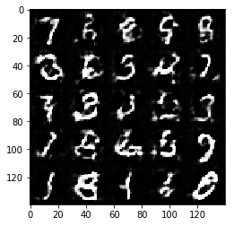
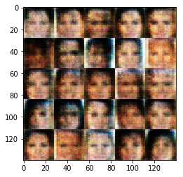

# Face Generation
In this project, you'll use generative adversarial networks to generate new images of faces.
### Get the Data
You'll be using two datasets in this project:
- MNIST
- CelebA

Since the celebA dataset is complex and you're doing GANs in a project for the first time, we want you to test your neural network on MNIST before CelebA.  Running the GANs on MNIST will allow you to see how well your model trains sooner.

If you're using [FloydHub](https://www.floydhub.com/), set `data_dir` to "/input" and use the [FloydHub data ID](http://docs.floydhub.com/home/using_datasets/) "R5KrjnANiKVhLWAkpXhNBe".


```python
data_dir = './data'

# FloydHub - Use with data ID "R5KrjnANiKVhLWAkpXhNBe"
#data_dir = '/input'


"""
DON'T MODIFY ANYTHING IN THIS CELL
"""
import helper

helper.download_extract('mnist', data_dir)
helper.download_extract('celeba', data_dir)
```

    Found mnist Data
    Found celeba Data
    

## Explore the Data
### MNIST
As you're aware, the [MNIST](http://yann.lecun.com/exdb/mnist/) dataset contains images of handwritten digits. You can view the first number of examples by changing `show_n_images`. 


```python
show_n_images = 25

"""
DON'T MODIFY ANYTHING IN THIS CELL
"""
%matplotlib inline
import os
from glob import glob
from matplotlib import pyplot

mnist_images = helper.get_batch(glob(os.path.join(data_dir, 'mnist/*.jpg'))[:show_n_images], 28, 28, 'L')
pyplot.imshow(helper.images_square_grid(mnist_images, 'L'), cmap='gray')
```


    <matplotlib.image.AxesImage at 0x7f3d12051160>


### CelebA
The [CelebFaces Attributes Dataset (CelebA)](http://mmlab.ie.cuhk.edu.hk/projects/CelebA.html) dataset contains over 200,000 celebrity images with annotations.  Since you're going to be generating faces, you won't need the annotations.  You can view the first number of examples by changing `show_n_images`.


```python
show_n_images = 25

"""
DON'T MODIFY ANYTHING IN THIS CELL
"""
mnist_images = helper.get_batch(glob(os.path.join(data_dir, 'img_align_celeba/*.jpg'))[:show_n_images], 28, 28, 'RGB')
pyplot.imshow(helper.images_square_grid(mnist_images, 'RGB'))
```


    <matplotlib.image.AxesImage at 0x7f3d11f809b0>


## Preprocess the Data
Since the project's main focus is on building the GANs, we'll preprocess the data for you.  The values of the MNIST and CelebA dataset will be in the range of -0.5 to 0.5 of 28x28 dimensional images.  The CelebA images will be cropped to remove parts of the image that don't include a face, then resized down to 28x28.

The MNIST images are black and white images with a single [color channel](https://en.wikipedia.org/wiki/Channel_(digital_image%29) while the CelebA images have [3 color channels (RGB color channel)](https://en.wikipedia.org/wiki/Channel_(digital_image%29#RGB_Images).
## Build the Neural Network
You'll build the components necessary to build a GANs by implementing the following functions below:
- `model_inputs`
- `discriminator`
- `generator`
- `model_loss`
- `model_opt`
- `train`

### Check the Version of TensorFlow and Access to GPU
This will check to make sure you have the correct version of TensorFlow and access to a GPU


```python
"""
DON'T MODIFY ANYTHING IN THIS CELL
"""
from distutils.version import LooseVersion
import warnings
import tensorflow as tf

# Check TensorFlow Version
assert LooseVersion(tf.__version__) >= LooseVersion('1.0'), 'Please use TensorFlow version 1.0 or newer.  You are using {}'.format(tf.__version__)
print('TensorFlow Version: {}'.format(tf.__version__))

# Check for a GPU
if not tf.test.gpu_device_name():
    warnings.warn('No GPU found. Please use a GPU to train your neural network.')
else:
    print('Default GPU Device: {}'.format(tf.test.gpu_device_name()))
```

    TensorFlow Version: 1.0.0
    Default GPU Device: /gpu:0
    

### Input
Implement the `model_inputs` function to create TF Placeholders for the Neural Network. It should create the following placeholders:
- Real input images placeholder with rank 4 using `image_width`, `image_height`, and `image_channels`.
- Z input placeholder with rank 2 using `z_dim`.
- Learning rate placeholder with rank 0.

Return the placeholders in the following the tuple (tensor of real input images, tensor of z data)


```python
import problem_unittests as tests

def model_inputs(image_width, image_height, image_channels, z_dim):
    """
    Create the model inputs
    :param image_width: The input image width
    :param image_height: The input image height
    :param image_channels: The number of image channels
    :param z_dim: The dimension of Z
    :return: Tuple of (tensor of real input images, tensor of z data, learning rate)
    """
    # TODO: Implement Function
    inputs_real = tf.placeholder(tf.float32, (None, image_width, image_height, image_channels), name = 'input_real')
    inputs_z = tf.placeholder(tf.float32, (None, z_dim), name = 'input_z')
    learning_rate = tf.placeholder(tf.float32, name = 'learning_rate')

    return inputs_real, inputs_z, learning_rate


"""
DON'T MODIFY ANYTHING IN THIS CELL THAT IS BELOW THIS LINE
"""
tests.test_model_inputs(model_inputs)
```

    Tests Passed
    

### Discriminator
Implement `discriminator` to create a discriminator neural network that discriminates on `images`.  This function should be able to reuse the variables in the neural network.  Use [`tf.variable_scope`](https://www.tensorflow.org/api_docs/python/tf/variable_scope) with a scope name of "discriminator" to allow the variables to be reused.  The function should return a tuple of (tensor output of the discriminator, tensor logits of the discriminator).


```python
def discriminator(images, reuse=False):
    """
    Create the discriminator network
    :param images: Tensor of input image(s)
    :param reuse: Boolean if the weights should be reused
    :return: Tuple of (tensor output of the discriminator, tensor logits of the discriminator)
    """
    # TODO: Implement Function
    alpha = 0.1
    stddev = 0.02
    
    with tf.variable_scope('discriminator', reuse = reuse):
        # Architecture:
        #     Input: 28x28x3
        #     Layer 1: conv2d, 14x14x32
        #     Layer 2: conv2d, 7x7x64
        #     Layer 3: conv2d, 4x4x128
        #     Layer 4: conv2d, 2x2x256
        #     Layer 5: flatten, 1x1024
        #     Calculate logits and prediction
        
        # Input: 28x28x3
        x1 = images
#         print('x1.shape is ', x1.shape)
        
        # Layer 1: 14x14x32
        layer_1 = tf.layers.conv2d(inputs = x1, 
                                   filters = 32, 
                                   kernel_size = [5, 5],
                                   strides = 2, 
                                   padding = 'same',
                                   kernel_initializer = tf.random_normal_initializer(stddev = stddev)
                                  )
        layer_1 = tf.maximum(alpha * layer_1, layer_1)
#         print('layer_1.shape is ', layer_1.shape)
        
        # Layer 2: 7x7x64
        layer_2 = tf.layers.conv2d(inputs = layer_1, 
                                   filters = 64, 
                                   kernel_size = [5, 5],
                                   strides = 2, 
                                   padding = 'same',
                                   kernel_initializer = tf.random_normal_initializer(stddev = stddev)
                                  )
        layer_2 = tf.layers.batch_normalization(layer_2, training = True)
        layer_2 = tf.maximum(alpha * layer_2, layer_2)
#         print('layer_2.shape is ', layer_2.shape)
        
        # Layer 3: 4x4x128
        layer_3 = tf.layers.conv2d(inputs = layer_2, 
                                   filters = 128, 
                                   kernel_size = [5, 5],
                                   strides = 2, 
                                   padding = 'same',
                                   kernel_initializer = tf.random_normal_initializer(stddev = stddev)
                                  )
        layer_3 = tf.layers.batch_normalization(layer_3, training = True)
        layer_3 = tf.maximum(alpha * layer_3, layer_3)
#         print('layer_3.shape is ', layer_3.shape)
        
        # Layer 4: 2x2x256
        layer_4 = tf.layers.conv2d(inputs = layer_3, 
                                   filters = 256, 
                                   kernel_size = [5, 5],
                                   strides = 2, 
                                   padding = 'same',
                                   kernel_initializer = tf.random_normal_initializer(stddev = stddev)
                                  )
        layer_4 = tf.layers.batch_normalization(layer_4, training = True)
        layer_4 = tf.maximum(alpha * layer_4, layer_4)
#         print('layer_4.shape is ', layer_4.shape)
        
        # Layer 5: 1x1024
        layer_5 = tf.reshape(layer_4, (-1, 2 * 2 * 256))
#         print('layer_5.shape is ', layer_5.shape)
        
        # Calculate logits
        logits = tf.layers.dense(inputs = layer_5, 
                                 units = 1, 
                                 kernel_initializer = tf.random_normal_initializer(stddev = stddev),
                                )
        # Apply dropout layer
        logits = tf.layers.dropout(logits, rate = 0.5)
        
        # Prediction
        out = tf.sigmoid(logits)

        return out, logits


"""
DON'T MODIFY ANYTHING IN THIS CELL THAT IS BELOW THIS LINE
"""
tests.test_discriminator(discriminator, tf)
```

    Tests Passed
    

### Generator
Implement `generator` to generate an image using `z`. This function should be able to reuse the variables in the neural network.  Use [`tf.variable_scope`](https://www.tensorflow.org/api_docs/python/tf/variable_scope) with a scope name of "generator" to allow the variables to be reused. The function should return the generated 28 x 28 x `out_channel_dim` images.


```python
def generator(z, out_channel_dim, is_train=True):
    """
    Create the generator network
    :param z: Input z
    :param out_channel_dim: The number of channels in the output image
    :param is_train: Boolean if generator is being used for training
    :return: The tensor output of the generator
    """
    # TODO: Implement Function
    reuse = not is_train
    alpha = 0.1
    stddev = 0.02
#     print('reuse is', reuse)
    
    with tf.variable_scope('generator', reuse = reuse):
        # Architecture:
        #     Input: 7x7x256
        #     Layer 1: fully connected layer, 4x4x512
        #     Layer 2: conv2d, 7x7x128
        #     Layer 3: conv2d, 14x14x64
        #     Layer 4: conv2d, 28x28x32
        #     Calculate logits and prediction
        
        # Input: 7x7x256
        x1 = z
#         print('x1.shape is', x1.shape)
        
        # Layer 1: 4x4x512
        # Fully connected layer
        layer_1 = tf.layers.dense(x1, 4 * 4 * 512)
        # Reshape it to start the convolutional stack
        layer_1 = tf.reshape(layer_1, (-1, 4, 4, 512))
        layer_1 = tf.layers.batch_normalization(layer_1, training = is_train)
        layer_1 = tf.maximum(alpha * layer_1, layer_1)
#         print('layer_1.shape is', layer_1.shape)
        
        # Layer 2: 8x8x128
        layer_2 = tf.layers.conv2d_transpose(inputs = layer_1, 
                                             filters = 128, 
                                             kernel_size = [4, 4],
                                             strides = 1,
                                             padding = 'valid',
                                             kernel_initializer = tf.random_normal_initializer(stddev = stddev)
                                            )
        layer_2 = tf.layers.batch_normalization(layer_2, training = is_train)
        layer_2 = tf.maximum(alpha * layer_2, layer_2)
#         print('layer_2.shape is', layer_2.shape)
        
        # Layer 3: 16x16x64
        layer_3 = tf.layers.conv2d_transpose(inputs = layer_2, 
                                             filters = 64, 
                                             kernel_size = [5, 5],
                                             strides = 2,
                                             padding = 'same',
                                             kernel_initializer = tf.random_normal_initializer(stddev = stddev)
                                            )
        layer_3 = tf.layers.batch_normalization(layer_3, training = is_train)
        layer_3 = tf.maximum(alpha * layer_3, layer_3)
#         print('layer_3.shape is', layer_3.shape)
        
        # Layer 4: 32x32x32
        layer_4 = tf.layers.conv2d_transpose(inputs = layer_3, 
                                             filters = 32, 
                                             kernel_size = [5, 5],
                                             strides = 2,
                                             padding = 'same',
                                             kernel_initializer = tf.random_normal_initializer(stddev = stddev)
                                            )
        layer_4 = tf.layers.batch_normalization(layer_4, training = is_train)
        layer_4 = tf.maximum(alpha * layer_4, layer_4)
#         print('layer_4.shape is', layer_4.shape)
        
        # Calculate logits： 28x28x5
        logits = tf.layers.conv2d_transpose(inputs = layer_4,
                                            filters = out_channel_dim,
                                            kernel_size = [3, 3],
                                            strides = 1,
                                            padding = 'same',
                                            kernel_initializer = tf.random_normal_initializer(stddev = stddev)
                                           )
#         print('out_channel_dim is ', out_channel_dim)
#         print('logits.shape is', logits.shape)
        
        # Prediction
        out = tf.tanh(logits)
        
        return out


"""
DON'T MODIFY ANYTHING IN THIS CELL THAT IS BELOW THIS LINE
"""
tests.test_generator(generator, tf)
```

    Tests Passed
    

### Loss
Implement `model_loss` to build the GANs for training and calculate the loss.  The function should return a tuple of (discriminator loss, generator loss).  Use the following functions you implemented:
- `discriminator(images, reuse=False)`
- `generator(z, out_channel_dim, is_train=True)`


```python
import numpy as np
```


```python
def model_loss(input_real, input_z, out_channel_dim):
    """
    Get the loss for the discriminator and generator
    :param input_real: Images from the real dataset
    :param input_z: Z input
    :param out_channel_dim: The number of channels in the output image
    :return: A tuple of (discriminator loss, generator loss)
    """
    # TODO: Implement Function
    # Generate the fake image
    input_fake = generator(input_z, out_channel_dim)
    
    # Calculate losses from discriminator
    d_output_real, d_logits_real = discriminator(input_real)
    d_output_fake, d_logits_fake = discriminator(input_fake, reuse=True)
    
    d_loss_real = tf.reduce_mean(tf.nn.sigmoid_cross_entropy_with_logits(logits = d_logits_real,
                                                                         labels = tf.ones_like(d_logits_real) * 0.9
#                                                                          labels = tf.ones_like(d_logits_real) * np.random.uniform(0.7, 1.2)
                                                                        )
                                )
    d_loss_fake = tf.reduce_mean(tf.nn.sigmoid_cross_entropy_with_logits(logits = d_logits_fake,
                                                                         labels = tf.zeros_like(d_logits_real)
#                                                                          labels = tf.ones_like(d_logits_real) * np.random.uniform(0.0, 0.3)
                                                                        )
                                )
    
    # Calculate losses for the discriminator and generator
    d_loss = d_loss_real + d_loss_fake
    g_loss = tf.reduce_mean(tf.nn.sigmoid_cross_entropy_with_logits(logits = d_logits_fake,
                                                                    labels = tf.ones_like(d_logits_fake)
                                                                   )
                           )
    
    return d_loss, g_loss


"""
DON'T MODIFY ANYTHING IN THIS CELL THAT IS BELOW THIS LINE
"""
tests.test_model_loss(model_loss)
```

    Tests Passed
    

### Optimization
Implement `model_opt` to create the optimization operations for the GANs. Use [`tf.trainable_variables`](https://www.tensorflow.org/api_docs/python/tf/trainable_variables) to get all the trainable variables.  Filter the variables with names that are in the discriminator and generator scope names.  The function should return a tuple of (discriminator training operation, generator training operation).


```python
def model_opt(d_loss, g_loss, learning_rate, beta1):
    """
    Get optimization operations
    :param d_loss: Discriminator loss Tensor
    :param g_loss: Generator loss Tensor
    :param learning_rate: Learning Rate Placeholder
    :param beta1: The exponential decay rate for the 1st moment in the optimizer
    :return: A tuple of (discriminator training operation, generator training operation)
    """
    # TODO: Implement Function
    
    # Get the trainable_variables, split into G and D parts
    t_vars = tf.trainable_variables()
    g_vars = [var for var in t_vars if var.name.startswith('generator')]
    d_vars = [var for var in t_vars if var.name.startswith('discriminator')]
    
    update_ops = tf.get_collection(tf.GraphKeys.UPDATE_OPS)
    gen_updates = [op for op in update_ops if op.name.startswith('generator')]
    
    with tf.control_dependencies(gen_updates):
        g_train_opt = tf.train.AdamOptimizer(learning_rate, beta1 = beta1).minimize(g_loss,
                                                                                    var_list = g_vars)
        d_train_opt = tf.train.AdamOptimizer(learning_rate, beta1 = beta1).minimize(d_loss,
                                                                                    var_list = d_vars)
    
    return d_train_opt, g_train_opt


"""
DON'T MODIFY ANYTHING IN THIS CELL THAT IS BELOW THIS LINE
"""
tests.test_model_opt(model_opt, tf)
```

    Tests Passed
    

## Neural Network Training
### Show Output
Use this function to show the current output of the generator during training. It will help you determine how well the GANs is training.


```python
"""
DON'T MODIFY ANYTHING IN THIS CELL
"""
import numpy as np

def show_generator_output(sess, n_images, input_z, out_channel_dim, image_mode):
    """
    Show example output for the generator
    :param sess: TensorFlow session
    :param n_images: Number of Images to display
    :param input_z: Input Z Tensor
    :param out_channel_dim: The number of channels in the output image
    :param image_mode: The mode to use for images ("RGB" or "L")
    """
    cmap = None if image_mode == 'RGB' else 'gray'
    z_dim = input_z.get_shape().as_list()[-1]
    example_z = np.random.uniform(-1, 1, size=[n_images, z_dim])

    samples = sess.run(
        generator(input_z, out_channel_dim, False),
        feed_dict={input_z: example_z})

    images_grid = helper.images_square_grid(samples, image_mode)
    pyplot.imshow(images_grid, cmap=cmap)
    pyplot.show()
```

### Train
Implement `train` to build and train the GANs.  Use the following functions you implemented:
- `model_inputs(image_width, image_height, image_channels, z_dim)`
- `model_loss(input_real, input_z, out_channel_dim)`
- `model_opt(d_loss, g_loss, learning_rate, beta1)`

Use the `show_generator_output` to show `generator` output while you train. Running `show_generator_output` for every batch will drastically increase training time and increase the size of the notebook.  It's recommended to print the `generator` output every 100 batches.


```python
def train(epoch_count, batch_size, z_dim, learning_rate, beta1, get_batches, data_shape, data_image_mode):
    """
    Train the GAN
    :param epoch_count: Number of epochs
    :param batch_size: Batch Size
    :param z_dim: Z dimension
    :param learning_rate: Learning Rate
    :param beta1: The exponential decay rate for the 1st moment in the optimizer
    :param get_batches: Function to get batches
    :param data_shape: Shape of the data
    :param data_image_mode: The image mode to use for images ("RGB" or "L")
    """
    # TODO: Build Model
    # Create model inputs
    input_real, input_z, input_learning_rate = model_inputs(image_width = data_shape[1], 
                                                        image_height = data_shape[2], 
                                                        image_channels = data_shape[3], 
                                                        z_dim = z_dim
                                                       )
    # Create model loss
    d_loss, g_loss = model_loss(input_real, 
                                input_z, 
                                out_channel_dim = data_shape[3]
                               )
    # Create model optimizer
    d_train_opt, g_train_opt = model_opt(d_loss, 
                                         g_loss, 
                                         learning_rate, 
                                         beta1
                                        )
    
    # Create counter for printing result and showing genrated image
    counter = 0
    counts_per_print = 10
    counts_per_show = 100
    
    with tf.Session() as sess:
        sess.run(tf.global_variables_initializer())
        for epoch_i in range(epoch_count):
            for batch_images in get_batches(batch_size):
                # TODO: Train Model
                
                # Get images, resahpe and rescale to pass to D
#                 print('batch_size is ', batch_size)
#                 print('batch_images.shape is ', batch_images.shape)
#                 print('batch_images[0].shape is ', batch_images[0].shape)
#                 batch_images = batch_images.reshape((batch_size, 784))
#                 print('batch_images.shape is ', batch_images.shape)
                batch_images *= 2
#                 batch_images = batch_images * 2 - 1
                
                # Sample random noise for G
                batch_z = np.random.uniform(-1, 1, size = (batch_size, z_dim))
                
                # Run optimizers
                _ = sess.run(d_train_opt, 
                             feed_dict = {input_real: batch_images,
                                          input_z: batch_z,
                                          input_learning_rate: learning_rate
                                         }
                            )
                
                _ = sess.run(g_train_opt, 
                             feed_dict = {#input_real: batch_images,
                                          input_z: batch_z,
                                          input_learning_rate: learning_rate
                                         }
                            )
                
                counter += 1
                
                # Print result
                if 0 == counter % counts_per_print:    
                    # At the end of 100 batches, get the losses and print them out
                    train_loss_d = sess.run(d_loss,
                                            {input_z: batch_z,
                                             input_real: batch_images
                                            }
                                           )
                    train_loss_g = g_loss.eval({input_z: batch_z})
                    
                    print("Epoch {}/{}...".format(epoch_i + 1, epoch_count),
                          "Discriminator Loss: {:.4f}...".format(train_loss_d),
                          "Generator Loss: {:.4f}".format(train_loss_g)
                         )
                
                # Show generated image
                if 0 == counter % counts_per_show:
                    show_generator_output(sess,
                                          25,
                                          input_z,
                                          data_shape[3],
                                          data_image_mode
                                         )
```

### MNIST
Test your GANs architecture on MNIST.  After 2 epochs, the GANs should be able to generate images that look like handwritten digits.  Make sure the loss of the generator is lower than the loss of the discriminator or close to 0.


```python
import time
```


```python
t0 = time.time()
```


```python
batch_size = 64
z_dim = 128
learning_rate = 0.0001
beta1 = 0.5


"""
DON'T MODIFY ANYTHING IN THIS CELL THAT IS BELOW THIS LINE
"""
epochs = 2

mnist_dataset = helper.Dataset('mnist', glob(os.path.join(data_dir, 'mnist/*.jpg')))
with tf.Graph().as_default():
    train(epochs, batch_size, z_dim, learning_rate, beta1, mnist_dataset.get_batches,
          mnist_dataset.shape, mnist_dataset.image_mode)
```

    Epoch 1/2... Discriminator Loss: 0.8786... Generator Loss: 1.0861
    Epoch 1/2... Discriminator Loss: 1.0110... Generator Loss: 1.0053
    Epoch 1/2... Discriminator Loss: 0.8371... Generator Loss: 1.2729
    Epoch 1/2... Discriminator Loss: 0.7532... Generator Loss: 1.3259
    Epoch 1/2... Discriminator Loss: 0.4783... Generator Loss: 2.3715
    Epoch 1/2... Discriminator Loss: 0.5383... Generator Loss: 2.0404
    Epoch 1/2... Discriminator Loss: 0.5613... Generator Loss: 1.8806
    Epoch 1/2... Discriminator Loss: 0.3739... Generator Loss: 3.5609
    Epoch 1/2... Discriminator Loss: 0.4216... Generator Loss: 2.8662
    Epoch 1/2... Discriminator Loss: 0.4024... Generator Loss: 2.9862
    


    Epoch 1/2... Discriminator Loss: 0.3873... Generator Loss: 3.2289
    Epoch 1/2... Discriminator Loss: 0.4132... Generator Loss: 2.6696
    Epoch 1/2... Discriminator Loss: 1.9401... Generator Loss: 0.2963
    Epoch 1/2... Discriminator Loss: 0.5086... Generator Loss: 2.5346
    Epoch 1/2... Discriminator Loss: 0.3618... Generator Loss: 4.3760
    Epoch 1/2... Discriminator Loss: 0.3763... Generator Loss: 3.3585
    Epoch 1/2... Discriminator Loss: 0.4365... Generator Loss: 2.7536
    Epoch 1/2... Discriminator Loss: 0.4303... Generator Loss: 3.0427
    Epoch 1/2... Discriminator Loss: 0.3781... Generator Loss: 4.4560
    Epoch 1/2... Discriminator Loss: 0.7277... Generator Loss: 1.5230
    


    Epoch 1/2... Discriminator Loss: 0.5624... Generator Loss: 1.9493
    Epoch 1/2... Discriminator Loss: 0.9353... Generator Loss: 4.8811
    Epoch 1/2... Discriminator Loss: 0.6441... Generator Loss: 1.6095
    Epoch 1/2... Discriminator Loss: 0.5137... Generator Loss: 2.6057
    Epoch 1/2... Discriminator Loss: 0.7476... Generator Loss: 2.7668
    Epoch 1/2... Discriminator Loss: 0.6191... Generator Loss: 2.2464
    Epoch 1/2... Discriminator Loss: 0.7603... Generator Loss: 1.3233
    Epoch 1/2... Discriminator Loss: 0.9556... Generator Loss: 0.9130
    Epoch 1/2... Discriminator Loss: 1.0680... Generator Loss: 3.0342
    Epoch 1/2... Discriminator Loss: 0.7308... Generator Loss: 2.2944
    


    Epoch 1/2... Discriminator Loss: 1.3488... Generator Loss: 0.5394
    Epoch 1/2... Discriminator Loss: 0.8047... Generator Loss: 1.2477
    Epoch 1/2... Discriminator Loss: 0.8021... Generator Loss: 1.1298
    Epoch 1/2... Discriminator Loss: 0.6535... Generator Loss: 1.4983
    Epoch 1/2... Discriminator Loss: 0.9787... Generator Loss: 3.4295
    Epoch 1/2... Discriminator Loss: 0.6177... Generator Loss: 1.8531
    Epoch 1/2... Discriminator Loss: 0.5524... Generator Loss: 2.2486
    Epoch 1/2... Discriminator Loss: 0.7436... Generator Loss: 1.6597
    Epoch 1/2... Discriminator Loss: 0.7558... Generator Loss: 2.3927
    Epoch 1/2... Discriminator Loss: 0.6717... Generator Loss: 1.7780
    


    Epoch 1/2... Discriminator Loss: 0.7683... Generator Loss: 2.5039
    Epoch 1/2... Discriminator Loss: 0.9529... Generator Loss: 0.8690
    Epoch 1/2... Discriminator Loss: 0.6247... Generator Loss: 1.8311
    Epoch 1/2... Discriminator Loss: 1.2663... Generator Loss: 0.6199
    Epoch 1/2... Discriminator Loss: 0.7396... Generator Loss: 1.8977
    Epoch 1/2... Discriminator Loss: 1.2559... Generator Loss: 0.6444
    Epoch 1/2... Discriminator Loss: 0.5962... Generator Loss: 2.0681
    Epoch 1/2... Discriminator Loss: 1.3178... Generator Loss: 0.5587
    Epoch 1/2... Discriminator Loss: 0.6996... Generator Loss: 1.6200
    Epoch 1/2... Discriminator Loss: 0.8378... Generator Loss: 1.2212
    


    Epoch 1/2... Discriminator Loss: 0.6432... Generator Loss: 1.7041
    Epoch 1/2... Discriminator Loss: 0.9541... Generator Loss: 0.9120
    Epoch 1/2... Discriminator Loss: 1.1340... Generator Loss: 0.7304
    Epoch 1/2... Discriminator Loss: 0.7993... Generator Loss: 2.2766
    Epoch 1/2... Discriminator Loss: 0.7374... Generator Loss: 1.6749
    Epoch 1/2... Discriminator Loss: 0.8162... Generator Loss: 1.1767
    Epoch 1/2... Discriminator Loss: 0.8837... Generator Loss: 1.0461
    Epoch 1/2... Discriminator Loss: 0.8349... Generator Loss: 1.0724
    Epoch 1/2... Discriminator Loss: 0.7354... Generator Loss: 1.4914
    Epoch 1/2... Discriminator Loss: 0.8611... Generator Loss: 1.0863
    


    Epoch 1/2... Discriminator Loss: 0.6428... Generator Loss: 1.7248
    Epoch 1/2... Discriminator Loss: 0.8316... Generator Loss: 1.8927
    Epoch 1/2... Discriminator Loss: 0.8849... Generator Loss: 1.0602
    Epoch 1/2... Discriminator Loss: 0.7169... Generator Loss: 1.8731
    Epoch 1/2... Discriminator Loss: 0.7159... Generator Loss: 1.4800
    Epoch 1/2... Discriminator Loss: 1.0983... Generator Loss: 0.7426
    Epoch 1/2... Discriminator Loss: 0.7525... Generator Loss: 1.6827
    Epoch 1/2... Discriminator Loss: 1.1483... Generator Loss: 2.7194
    Epoch 1/2... Discriminator Loss: 0.9108... Generator Loss: 2.0147
    Epoch 1/2... Discriminator Loss: 1.3525... Generator Loss: 0.5625
    


    Epoch 1/2... Discriminator Loss: 0.9714... Generator Loss: 0.8942
    Epoch 1/2... Discriminator Loss: 0.8150... Generator Loss: 1.3192
    Epoch 1/2... Discriminator Loss: 0.8202... Generator Loss: 1.1207
    Epoch 1/2... Discriminator Loss: 1.0237... Generator Loss: 0.8211
    Epoch 1/2... Discriminator Loss: 0.7934... Generator Loss: 1.6648
    Epoch 1/2... Discriminator Loss: 0.9432... Generator Loss: 1.0043
    Epoch 1/2... Discriminator Loss: 0.8335... Generator Loss: 1.9633
    Epoch 1/2... Discriminator Loss: 1.6232... Generator Loss: 0.3777
    Epoch 1/2... Discriminator Loss: 0.8083... Generator Loss: 1.2089
    Epoch 1/2... Discriminator Loss: 1.5741... Generator Loss: 0.4025
    


    Epoch 1/2... Discriminator Loss: 0.8302... Generator Loss: 1.2815
    Epoch 1/2... Discriminator Loss: 1.0413... Generator Loss: 0.7986
    Epoch 1/2... Discriminator Loss: 1.1523... Generator Loss: 0.7512
    Epoch 1/2... Discriminator Loss: 1.0972... Generator Loss: 0.8236
    Epoch 1/2... Discriminator Loss: 1.0697... Generator Loss: 0.8915
    Epoch 1/2... Discriminator Loss: 1.1389... Generator Loss: 0.7116
    Epoch 1/2... Discriminator Loss: 0.7967... Generator Loss: 1.7165
    Epoch 1/2... Discriminator Loss: 1.0449... Generator Loss: 0.8432
    Epoch 1/2... Discriminator Loss: 1.0519... Generator Loss: 0.8446
    Epoch 1/2... Discriminator Loss: 0.8004... Generator Loss: 1.6747
    





    Epoch 1/2... Discriminator Loss: 1.1852... Generator Loss: 0.6437
    Epoch 1/2... Discriminator Loss: 0.9258... Generator Loss: 1.3584
    Epoch 1/2... Discriminator Loss: 0.8231... Generator Loss: 1.6417
    Epoch 2/2... Discriminator Loss: 0.9078... Generator Loss: 1.4953
    Epoch 2/2... Discriminator Loss: 1.1320... Generator Loss: 0.7233
    Epoch 2/2... Discriminator Loss: 1.0796... Generator Loss: 0.7640
    Epoch 2/2... Discriminator Loss: 0.9128... Generator Loss: 1.0993
    Epoch 2/2... Discriminator Loss: 1.2503... Generator Loss: 2.3911
    Epoch 2/2... Discriminator Loss: 0.8148... Generator Loss: 1.2178
    Epoch 2/2... Discriminator Loss: 1.1645... Generator Loss: 0.7086
    


    Epoch 2/2... Discriminator Loss: 1.0868... Generator Loss: 0.7671
    Epoch 2/2... Discriminator Loss: 1.0136... Generator Loss: 0.8110
    Epoch 2/2... Discriminator Loss: 0.8908... Generator Loss: 1.4261
    Epoch 2/2... Discriminator Loss: 0.8656... Generator Loss: 1.2395
    Epoch 2/2... Discriminator Loss: 0.9211... Generator Loss: 1.1262
    Epoch 2/2... Discriminator Loss: 1.3299... Generator Loss: 0.5392
    Epoch 2/2... Discriminator Loss: 1.0411... Generator Loss: 0.8513
    Epoch 2/2... Discriminator Loss: 1.0030... Generator Loss: 1.6279
    Epoch 2/2... Discriminator Loss: 0.8761... Generator Loss: 1.5020
    Epoch 2/2... Discriminator Loss: 0.9283... Generator Loss: 1.3817
    


    Epoch 2/2... Discriminator Loss: 0.9212... Generator Loss: 0.9964
    Epoch 2/2... Discriminator Loss: 1.1694... Generator Loss: 0.6525
    Epoch 2/2... Discriminator Loss: 0.9670... Generator Loss: 0.8871
    Epoch 2/2... Discriminator Loss: 0.8749... Generator Loss: 1.4840
    Epoch 2/2... Discriminator Loss: 1.4950... Generator Loss: 0.4460
    Epoch 2/2... Discriminator Loss: 1.2560... Generator Loss: 0.5940
    Epoch 2/2... Discriminator Loss: 0.9306... Generator Loss: 1.7728
    Epoch 2/2... Discriminator Loss: 0.8933... Generator Loss: 1.4809
    Epoch 2/2... Discriminator Loss: 1.0753... Generator Loss: 1.8145
    Epoch 2/2... Discriminator Loss: 0.8403... Generator Loss: 1.2121
    


    Epoch 2/2... Discriminator Loss: 0.8282... Generator Loss: 1.8351
    Epoch 2/2... Discriminator Loss: 1.0395... Generator Loss: 2.2216
    Epoch 2/2... Discriminator Loss: 0.8990... Generator Loss: 1.2229
    Epoch 2/2... Discriminator Loss: 1.0110... Generator Loss: 0.8553
    Epoch 2/2... Discriminator Loss: 1.1192... Generator Loss: 0.7082
    Epoch 2/2... Discriminator Loss: 1.0598... Generator Loss: 0.7380
    Epoch 2/2... Discriminator Loss: 1.3246... Generator Loss: 0.5184
    Epoch 2/2... Discriminator Loss: 1.0935... Generator Loss: 0.7416
    Epoch 2/2... Discriminator Loss: 0.9480... Generator Loss: 1.0447
    Epoch 2/2... Discriminator Loss: 0.9702... Generator Loss: 0.8899
    


    Epoch 2/2... Discriminator Loss: 0.8714... Generator Loss: 1.1594
    Epoch 2/2... Discriminator Loss: 1.0656... Generator Loss: 1.8542
    Epoch 2/2... Discriminator Loss: 0.8726... Generator Loss: 1.1441
    Epoch 2/2... Discriminator Loss: 0.8842... Generator Loss: 1.0563
    Epoch 2/2... Discriminator Loss: 0.9702... Generator Loss: 1.9078
    Epoch 2/2... Discriminator Loss: 0.9199... Generator Loss: 1.1055
    Epoch 2/2... Discriminator Loss: 0.8112... Generator Loss: 1.2425
    Epoch 2/2... Discriminator Loss: 0.8629... Generator Loss: 1.6201
    Epoch 2/2... Discriminator Loss: 0.7079... Generator Loss: 1.7289
    Epoch 2/2... Discriminator Loss: 1.0826... Generator Loss: 0.7329
    


    Epoch 2/2... Discriminator Loss: 0.7826... Generator Loss: 1.5683
    Epoch 2/2... Discriminator Loss: 1.0570... Generator Loss: 0.8817
    Epoch 2/2... Discriminator Loss: 1.3351... Generator Loss: 0.4963
    Epoch 2/2... Discriminator Loss: 1.1093... Generator Loss: 0.7615
    Epoch 2/2... Discriminator Loss: 0.9158... Generator Loss: 1.3897
    Epoch 2/2... Discriminator Loss: 0.8390... Generator Loss: 1.3643
    Epoch 2/2... Discriminator Loss: 1.1477... Generator Loss: 0.6993
    Epoch 2/2... Discriminator Loss: 0.8790... Generator Loss: 1.5952
    Epoch 2/2... Discriminator Loss: 0.9281... Generator Loss: 1.4010
    Epoch 2/2... Discriminator Loss: 1.1588... Generator Loss: 1.2257
    


    Epoch 2/2... Discriminator Loss: 0.8060... Generator Loss: 1.2616
    Epoch 2/2... Discriminator Loss: 1.7533... Generator Loss: 0.3238
    Epoch 2/2... Discriminator Loss: 0.9594... Generator Loss: 0.8819
    Epoch 2/2... Discriminator Loss: 0.9794... Generator Loss: 0.8548
    Epoch 2/2... Discriminator Loss: 0.9408... Generator Loss: 0.9412
    Epoch 2/2... Discriminator Loss: 0.8706... Generator Loss: 1.1031
    Epoch 2/2... Discriminator Loss: 1.2691... Generator Loss: 0.5619
    Epoch 2/2... Discriminator Loss: 0.9884... Generator Loss: 0.8244
    Epoch 2/2... Discriminator Loss: 0.8931... Generator Loss: 1.9006
    Epoch 2/2... Discriminator Loss: 0.9666... Generator Loss: 1.2922
    


    Epoch 2/2... Discriminator Loss: 1.0156... Generator Loss: 0.8700
    Epoch 2/2... Discriminator Loss: 0.7925... Generator Loss: 1.2263
    Epoch 2/2... Discriminator Loss: 0.9358... Generator Loss: 1.2401
    Epoch 2/2... Discriminator Loss: 0.8104... Generator Loss: 1.4486
    Epoch 2/2... Discriminator Loss: 1.1470... Generator Loss: 1.8503
    Epoch 2/2... Discriminator Loss: 1.4630... Generator Loss: 0.4439
    Epoch 2/2... Discriminator Loss: 0.9577... Generator Loss: 0.9367
    Epoch 2/2... Discriminator Loss: 1.2334... Generator Loss: 0.5866
    Epoch 2/2... Discriminator Loss: 1.2220... Generator Loss: 0.6247
    Epoch 2/2... Discriminator Loss: 0.7913... Generator Loss: 1.4624
    


    Epoch 2/2... Discriminator Loss: 1.1158... Generator Loss: 0.7056
    Epoch 2/2... Discriminator Loss: 1.2480... Generator Loss: 0.5605
    Epoch 2/2... Discriminator Loss: 0.9010... Generator Loss: 1.0138
    Epoch 2/2... Discriminator Loss: 0.8423... Generator Loss: 1.7154
    Epoch 2/2... Discriminator Loss: 0.9082... Generator Loss: 1.6746
    Epoch 2/2... Discriminator Loss: 0.7814... Generator Loss: 1.5843
    Epoch 2/2... Discriminator Loss: 1.0251... Generator Loss: 0.7991
    Epoch 2/2... Discriminator Loss: 1.1901... Generator Loss: 0.6275
    Epoch 2/2... Discriminator Loss: 0.9863... Generator Loss: 1.1069
    Epoch 2/2... Discriminator Loss: 0.9755... Generator Loss: 2.0475
    


    Epoch 2/2... Discriminator Loss: 1.2634... Generator Loss: 0.5595
    Epoch 2/2... Discriminator Loss: 0.9889... Generator Loss: 1.1015
    Epoch 2/2... Discriminator Loss: 0.8481... Generator Loss: 1.3966
    Epoch 2/2... Discriminator Loss: 1.0578... Generator Loss: 1.0481
    Epoch 2/2... Discriminator Loss: 1.0641... Generator Loss: 0.7750
    Epoch 2/2... Discriminator Loss: 0.8669... Generator Loss: 1.5923
    Epoch 2/2... Discriminator Loss: 1.0363... Generator Loss: 0.8381
    


```python
t1 = time.time()

print('{:.4f} seconds to train the GAN on MNIST data.'.format(t1-t0))
```

    204.8173 seconds to train the GAN on MNIST data.
    

### CelebA
Run your GANs on CelebA.  It will take around 20 minutes on the average GPU to run one epoch.  You can run the whole epoch or stop when it starts to generate realistic faces.


```python
t0 = time.time()
```


```python
batch_size = 128
z_dim = 128
learning_rate = 0.0001
beta1 = 0.5


"""
DON'T MODIFY ANYTHING IN THIS CELL THAT IS BELOW THIS LINE
"""
epochs = 1

celeba_dataset = helper.Dataset('celeba', glob(os.path.join(data_dir, 'img_align_celeba/*.jpg')))
with tf.Graph().as_default():
    train(epochs, batch_size, z_dim, learning_rate, beta1, celeba_dataset.get_batches,
          celeba_dataset.shape, celeba_dataset.image_mode)
```

    Epoch 1/1... Discriminator Loss: 0.7134... Generator Loss: 1.3641
    Epoch 1/1... Discriminator Loss: 0.7036... Generator Loss: 1.4746
    Epoch 1/1... Discriminator Loss: 0.6982... Generator Loss: 1.5405
    Epoch 1/1... Discriminator Loss: 0.6153... Generator Loss: 1.9194
    Epoch 1/1... Discriminator Loss: 0.6440... Generator Loss: 1.6183
    Epoch 1/1... Discriminator Loss: 0.6398... Generator Loss: 1.7989
    Epoch 1/1... Discriminator Loss: 0.5578... Generator Loss: 2.8496
    Epoch 1/1... Discriminator Loss: 0.6283... Generator Loss: 1.7446
    Epoch 1/1... Discriminator Loss: 0.6118... Generator Loss: 1.9266
    Epoch 1/1... Discriminator Loss: 0.7017... Generator Loss: 1.6122
    


    Epoch 1/1... Discriminator Loss: 0.6675... Generator Loss: 1.6158
    Epoch 1/1... Discriminator Loss: 0.7401... Generator Loss: 1.7489
    Epoch 1/1... Discriminator Loss: 0.7252... Generator Loss: 1.8695
    Epoch 1/1... Discriminator Loss: 0.8688... Generator Loss: 1.4936
    Epoch 1/1... Discriminator Loss: 0.6284... Generator Loss: 2.3962
    Epoch 1/1... Discriminator Loss: 0.6052... Generator Loss: 2.5160
    Epoch 1/1... Discriminator Loss: 0.6913... Generator Loss: 1.9462
    Epoch 1/1... Discriminator Loss: 0.8698... Generator Loss: 1.4440
    Epoch 1/1... Discriminator Loss: 0.8826... Generator Loss: 1.4826
    Epoch 1/1... Discriminator Loss: 0.6777... Generator Loss: 1.6909
    


    Epoch 1/1... Discriminator Loss: 0.6661... Generator Loss: 1.6862
    Epoch 1/1... Discriminator Loss: 0.8300... Generator Loss: 1.5116
    Epoch 1/1... Discriminator Loss: 1.0652... Generator Loss: 1.1633
    Epoch 1/1... Discriminator Loss: 0.8110... Generator Loss: 1.6355
    Epoch 1/1... Discriminator Loss: 0.7108... Generator Loss: 1.8911
    Epoch 1/1... Discriminator Loss: 0.8334... Generator Loss: 1.2656
    Epoch 1/1... Discriminator Loss: 0.9301... Generator Loss: 1.3643
    Epoch 1/1... Discriminator Loss: 0.8808... Generator Loss: 1.4637
    Epoch 1/1... Discriminator Loss: 1.1408... Generator Loss: 1.0144
    Epoch 1/1... Discriminator Loss: 0.7637... Generator Loss: 1.5849
    


    Epoch 1/1... Discriminator Loss: 0.8261... Generator Loss: 1.6287
    Epoch 1/1... Discriminator Loss: 0.6456... Generator Loss: 2.1365
    Epoch 1/1... Discriminator Loss: 0.7904... Generator Loss: 1.6932
    Epoch 1/1... Discriminator Loss: 0.8486... Generator Loss: 1.3799
    Epoch 1/1... Discriminator Loss: 0.8241... Generator Loss: 1.5760
    Epoch 1/1... Discriminator Loss: 0.5033... Generator Loss: 2.5122
    Epoch 1/1... Discriminator Loss: 0.5942... Generator Loss: 2.0679
    Epoch 1/1... Discriminator Loss: 0.8622... Generator Loss: 1.5304
    Epoch 1/1... Discriminator Loss: 0.8385... Generator Loss: 1.5949
    Epoch 1/1... Discriminator Loss: 0.9079... Generator Loss: 1.1822
    


    Epoch 1/1... Discriminator Loss: 0.8493... Generator Loss: 1.2941
    Epoch 1/1... Discriminator Loss: 0.9408... Generator Loss: 1.4818
    Epoch 1/1... Discriminator Loss: 1.1845... Generator Loss: 1.9580
    Epoch 1/1... Discriminator Loss: 1.0203... Generator Loss: 1.1752
    Epoch 1/1... Discriminator Loss: 1.0709... Generator Loss: 1.0068
    Epoch 1/1... Discriminator Loss: 0.8590... Generator Loss: 1.6760
    Epoch 1/1... Discriminator Loss: 1.0046... Generator Loss: 1.1186
    Epoch 1/1... Discriminator Loss: 1.1224... Generator Loss: 0.9007
    Epoch 1/1... Discriminator Loss: 0.7806... Generator Loss: 1.6082
    Epoch 1/1... Discriminator Loss: 1.0146... Generator Loss: 1.0926
    





    Epoch 1/1... Discriminator Loss: 1.0145... Generator Loss: 1.1373
    Epoch 1/1... Discriminator Loss: 1.0967... Generator Loss: 1.0459
    Epoch 1/1... Discriminator Loss: 0.9523... Generator Loss: 1.2198
    Epoch 1/1... Discriminator Loss: 0.9250... Generator Loss: 1.1457
    Epoch 1/1... Discriminator Loss: 0.9952... Generator Loss: 1.0813
    Epoch 1/1... Discriminator Loss: 0.9703... Generator Loss: 1.0689
    Epoch 1/1... Discriminator Loss: 1.0519... Generator Loss: 0.8163
    Epoch 1/1... Discriminator Loss: 1.0019... Generator Loss: 1.2682
    Epoch 1/1... Discriminator Loss: 1.1111... Generator Loss: 1.7695
    Epoch 1/1... Discriminator Loss: 0.9667... Generator Loss: 1.1288
    


    Epoch 1/1... Discriminator Loss: 1.1675... Generator Loss: 0.9477
    Epoch 1/1... Discriminator Loss: 0.9301... Generator Loss: 1.4533
    Epoch 1/1... Discriminator Loss: 0.8169... Generator Loss: 1.5719
    Epoch 1/1... Discriminator Loss: 0.7133... Generator Loss: 1.7216
    Epoch 1/1... Discriminator Loss: 0.8579... Generator Loss: 1.7864
    Epoch 1/1... Discriminator Loss: 1.3145... Generator Loss: 1.0097
    Epoch 1/1... Discriminator Loss: 1.1523... Generator Loss: 0.9271
    Epoch 1/1... Discriminator Loss: 1.1854... Generator Loss: 1.3157
    Epoch 1/1... Discriminator Loss: 0.9889... Generator Loss: 1.2802
    Epoch 1/1... Discriminator Loss: 0.7503... Generator Loss: 1.5988
    


    Epoch 1/1... Discriminator Loss: 1.0136... Generator Loss: 1.0951
    Epoch 1/1... Discriminator Loss: 1.2478... Generator Loss: 1.0946
    Epoch 1/1... Discriminator Loss: 1.0050... Generator Loss: 1.3908
    Epoch 1/1... Discriminator Loss: 0.9702... Generator Loss: 1.2777
    Epoch 1/1... Discriminator Loss: 0.9935... Generator Loss: 1.1470
    Epoch 1/1... Discriminator Loss: 1.1738... Generator Loss: 1.4747
    Epoch 1/1... Discriminator Loss: 0.8932... Generator Loss: 1.2341
    Epoch 1/1... Discriminator Loss: 1.4312... Generator Loss: 0.8530
    Epoch 1/1... Discriminator Loss: 1.2692... Generator Loss: 0.8973
    Epoch 1/1... Discriminator Loss: 0.9186... Generator Loss: 1.7260
    


    Epoch 1/1... Discriminator Loss: 1.0447... Generator Loss: 1.2255
    Epoch 1/1... Discriminator Loss: 1.0959... Generator Loss: 1.0058
    Epoch 1/1... Discriminator Loss: 1.3109... Generator Loss: 0.8391
    Epoch 1/1... Discriminator Loss: 1.1216... Generator Loss: 1.0042
    Epoch 1/1... Discriminator Loss: 1.0416... Generator Loss: 1.0705
    Epoch 1/1... Discriminator Loss: 1.1540... Generator Loss: 1.1939
    Epoch 1/1... Discriminator Loss: 1.0744... Generator Loss: 1.1977
    Epoch 1/1... Discriminator Loss: 1.1363... Generator Loss: 0.9510
    Epoch 1/1... Discriminator Loss: 0.9468... Generator Loss: 1.2661
    Epoch 1/1... Discriminator Loss: 1.0949... Generator Loss: 1.1603
    


    Epoch 1/1... Discriminator Loss: 1.1512... Generator Loss: 1.0245
    Epoch 1/1... Discriminator Loss: 1.1408... Generator Loss: 0.8100
    Epoch 1/1... Discriminator Loss: 1.1227... Generator Loss: 0.9386
    Epoch 1/1... Discriminator Loss: 0.8717... Generator Loss: 1.2305
    Epoch 1/1... Discriminator Loss: 1.0659... Generator Loss: 0.8488
    Epoch 1/1... Discriminator Loss: 1.0122... Generator Loss: 1.0887
    Epoch 1/1... Discriminator Loss: 1.0531... Generator Loss: 1.4583
    Epoch 1/1... Discriminator Loss: 1.0167... Generator Loss: 1.2554
    Epoch 1/1... Discriminator Loss: 1.0409... Generator Loss: 1.1609
    Epoch 1/1... Discriminator Loss: 0.9096... Generator Loss: 1.1420
    


    Epoch 1/1... Discriminator Loss: 0.8958... Generator Loss: 1.5136
    Epoch 1/1... Discriminator Loss: 0.9834... Generator Loss: 1.3351
    Epoch 1/1... Discriminator Loss: 1.1186... Generator Loss: 1.0386
    Epoch 1/1... Discriminator Loss: 1.0004... Generator Loss: 1.5680
    Epoch 1/1... Discriminator Loss: 0.9874... Generator Loss: 1.0943
    Epoch 1/1... Discriminator Loss: 1.0011... Generator Loss: 0.9528
    Epoch 1/1... Discriminator Loss: 1.0000... Generator Loss: 1.4955
    Epoch 1/1... Discriminator Loss: 1.0121... Generator Loss: 1.1362
    Epoch 1/1... Discriminator Loss: 1.0695... Generator Loss: 0.8339
    Epoch 1/1... Discriminator Loss: 1.0863... Generator Loss: 0.8709
    


    Epoch 1/1... Discriminator Loss: 1.0874... Generator Loss: 1.1717
    Epoch 1/1... Discriminator Loss: 1.0767... Generator Loss: 0.8821
    Epoch 1/1... Discriminator Loss: 1.0088... Generator Loss: 1.2706
    Epoch 1/1... Discriminator Loss: 1.0433... Generator Loss: 0.9714
    Epoch 1/1... Discriminator Loss: 1.0656... Generator Loss: 1.2846
    Epoch 1/1... Discriminator Loss: 1.0465... Generator Loss: 1.1976
    Epoch 1/1... Discriminator Loss: 1.0996... Generator Loss: 1.0108
    Epoch 1/1... Discriminator Loss: 0.9974... Generator Loss: 1.0135
    Epoch 1/1... Discriminator Loss: 1.1292... Generator Loss: 0.9287
    Epoch 1/1... Discriminator Loss: 0.9408... Generator Loss: 1.5128
    


    Epoch 1/1... Discriminator Loss: 1.1681... Generator Loss: 0.9036
    Epoch 1/1... Discriminator Loss: 1.0492... Generator Loss: 1.1490
    Epoch 1/1... Discriminator Loss: 1.1312... Generator Loss: 0.8505
    Epoch 1/1... Discriminator Loss: 1.0509... Generator Loss: 1.2712
    Epoch 1/1... Discriminator Loss: 1.2206... Generator Loss: 1.3366
    Epoch 1/1... Discriminator Loss: 1.1286... Generator Loss: 0.9828
    Epoch 1/1... Discriminator Loss: 1.0578... Generator Loss: 1.6664
    Epoch 1/1... Discriminator Loss: 0.9489... Generator Loss: 1.3517
    Epoch 1/1... Discriminator Loss: 0.9892... Generator Loss: 1.0120
    Epoch 1/1... Discriminator Loss: 1.0701... Generator Loss: 1.2370
    


    Epoch 1/1... Discriminator Loss: 1.0599... Generator Loss: 0.9291
    Epoch 1/1... Discriminator Loss: 1.0606... Generator Loss: 0.9197
    Epoch 1/1... Discriminator Loss: 1.1098... Generator Loss: 0.8459
    Epoch 1/1... Discriminator Loss: 1.0322... Generator Loss: 1.1030
    Epoch 1/1... Discriminator Loss: 1.0578... Generator Loss: 1.0528
    Epoch 1/1... Discriminator Loss: 1.2236... Generator Loss: 0.8624
    Epoch 1/1... Discriminator Loss: 1.0380... Generator Loss: 0.9449
    Epoch 1/1... Discriminator Loss: 0.8162... Generator Loss: 1.3773
    Epoch 1/1... Discriminator Loss: 1.0259... Generator Loss: 1.3869
    Epoch 1/1... Discriminator Loss: 0.9212... Generator Loss: 1.1796
    


    Epoch 1/1... Discriminator Loss: 1.2359... Generator Loss: 1.1691
    Epoch 1/1... Discriminator Loss: 0.9987... Generator Loss: 1.3168
    Epoch 1/1... Discriminator Loss: 0.9889... Generator Loss: 1.3957
    Epoch 1/1... Discriminator Loss: 0.9877... Generator Loss: 1.3886
    Epoch 1/1... Discriminator Loss: 0.9695... Generator Loss: 1.4282
    Epoch 1/1... Discriminator Loss: 1.0351... Generator Loss: 1.4392
    Epoch 1/1... Discriminator Loss: 1.0135... Generator Loss: 1.8100
    Epoch 1/1... Discriminator Loss: 1.0246... Generator Loss: 1.4192
    Epoch 1/1... Discriminator Loss: 0.9810... Generator Loss: 2.1262
    Epoch 1/1... Discriminator Loss: 0.9773... Generator Loss: 1.5796
    


    Epoch 1/1... Discriminator Loss: 1.1328... Generator Loss: 0.9286
    Epoch 1/1... Discriminator Loss: 1.0565... Generator Loss: 0.9645
    Epoch 1/1... Discriminator Loss: 1.0234... Generator Loss: 1.2135
    Epoch 1/1... Discriminator Loss: 1.0971... Generator Loss: 1.1075
    Epoch 1/1... Discriminator Loss: 1.0772... Generator Loss: 0.8230
    Epoch 1/1... Discriminator Loss: 1.0564... Generator Loss: 0.9815
    Epoch 1/1... Discriminator Loss: 1.1259... Generator Loss: 1.2318
    Epoch 1/1... Discriminator Loss: 1.0551... Generator Loss: 1.0126
    


```python
t1 = time.time()

print('{:.4f} seconds to train the GAN on CelebA data.'.format(t1-t0))
```

    427.5021 seconds to train the GAN on CelebA data.
    

### Submitting This Project
When submitting this project, make sure to run all the cells before saving the notebook. Save the notebook file as "dlnd_face_generation.ipynb" and save it as a HTML file under "File" -> "Download as". Include the "helper.py" and "problem_unittests.py" files in your submission.
